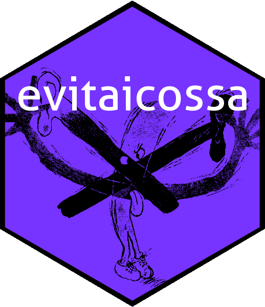

<!-- README.md is generated from README.Rmd. Please edit that file -->

```{r setup, include = FALSE}
knitr::opts_chunk$set(
  collapse = TRUE,
  comment = "#>",
  fig.path = "man/figures/README-",
  out.width = "100%"
)
```

# 

An *algebra* is a vector space equipped with a bilinear product: the
vectors may be multiplied.  Algebras may be defined over any field but
here we use the real numbers.  An _antiassociative_ algebra is an
algebra in which the usual associativity relation
$\mathbf{u}(\mathbf{v} \mathbf{w})=(\mathbf{u} \mathbf{v})\mathbf{w}$
for vector multiplication is replaced by $\mathbf{u}(\mathbf{v}
\mathbf{w})=-(\mathbf{u} \mathbf{v})\mathbf{w}$.  Antiassociative
algebras are nilpotent of nilindex 4: the product of any four vectors
is zero.  Antiassociative algebras are the direct sum of elements of
degree 1,2 and 3 (the antiassociativity condition implies that the
degree zero component is trivial, and the nilpotence ensures that
components of degree four or above do not exist).  Thus the general
form of an element of an antiassociative algebra is thus
$\scriptstyle\sum_{i}\alpha_i\mathbf{x}_i +
\sum_{i,j}\alpha_{ij}\mathbf{x}_i\mathbf{x}_j+
\sum_{i,j,k}\alpha_{ijk}(\mathbf{x}_i\mathbf{x}_j)\mathbf{x}_k$ where
$\scriptstyle\alpha_{i}$, $\scriptstyle\alpha_{ij}$,
$\scriptstyle\alpha_{ijk}$ are constants and the $\mathbf{x}_i$ are
indeterminates.

The `evitaicossa` package provides some R-centric functionality for
working with antiassociative algebras.  In an R session, you can
install the released version of the package from
[CRAN](https://CRAN.R-project.org) with:

```{r, message=FALSE}
# install.packages("evitaicossa")  # uncomment to install the package
library("evitaicossa")             # loads the package 
```

The package includes a single S4 class `aaa` [for
"**a**nti**a**ssociative **a**lgebra"] and a range of functions to
create objects of this class.  A good place to start is function
`raaa()`, which creates a random object of class `aaa`:


```{r label=makeevitaandicossa}
(evita <- raaa())
(icossa <- raaa())
(itna <- raaa())
```

Above, we see objects `evita`, `icossa` and `itna` are random
antiassociative algebra elements, with indeterminates `a`, `b`, `c`,
`d`.  These objects may be combined with standard arithmetic
operations:


```{r label=arithevitaandicossa}
evita+icossa
evita*icossa
```

It is possible to verify some of the axioms as follows:

```{r label=verifyaxioms}
c(
left_distributive  = evita*(icossa + itna) == evita*icossa + evita*itna,
right_distributive = (evita + icossa)*itna == evita*itna + icossa*itna,
antiassociative    = evita*(icossa*itna)   == -(evita*icossa)*itna
)
```

For further details, see the package vignette

`vignette("evitaicossa")`